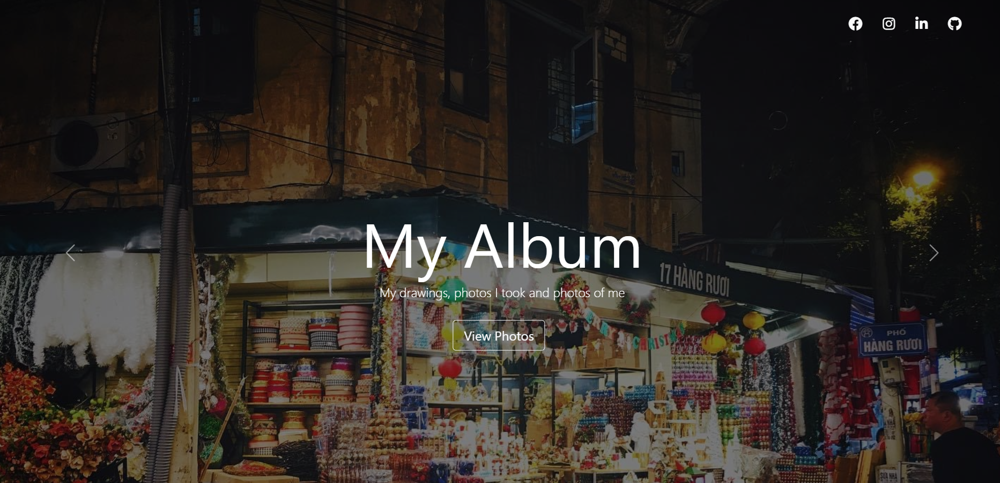
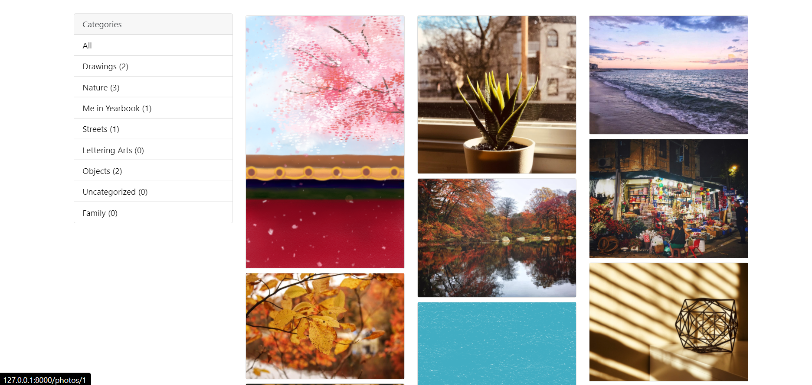
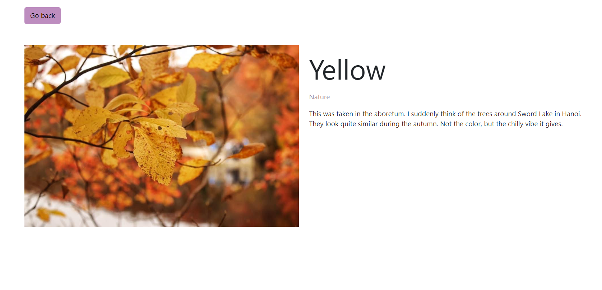

# Django Photo Album

A personal digital album app developed using Django framework

## Installation & Usage

I highly recommend creating a blank Django project and copy the code there, since I have hidden the Django key for production stage

## Problems and Future update

Deploy this project on Heroku and make sure everything runs smoothly

## Contributing
Pull requests are welcome. For major changes, please open an issue first to discuss what you would like to change.

Please make sure to update tests as appropriate.
